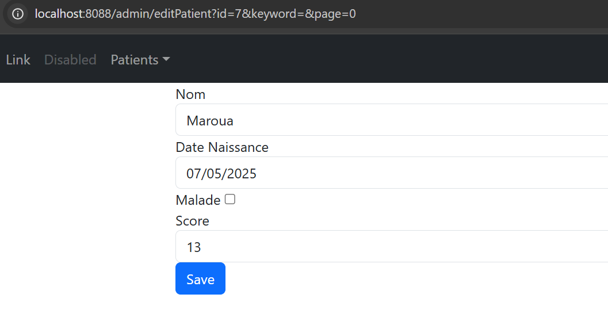
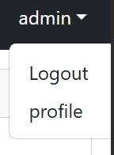
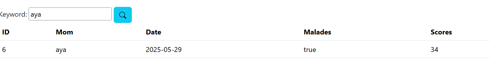

# Hospital Application

Ce projet est une **application de gestion hospitalière** développée avec **Spring Boot**, pensée pour être claire, robuste et facile à maintenir.  
Elle offre un ensemble complet de fonctionnalités permettant de gérer les patients d’un hôpital ainsi que les utilisateurs et leurs rôles, tout en appliquant des contrôles d’accès basés sur les rôles grâce à **Spring Security**.

L’application assure notamment :
- L’affichage dynamique des patients avec pagination et recherche.
- L’ajout, la modification et la suppression de patients par l’administrateur.
- Une interface de connexion sécurisée avec gestion des rôles (administrateur et utilisateur simple).
- Une protection des routes sensibles pour garantir un accès restreint selon le rôle de l’utilisateur.
- Une validation des formulaires pour garantir la cohérence et la qualité des données saisies.

L’application repose sur un ensemble de technologies modernes et bien intégrées :
- **Spring Boot** : Framework principal pour simplifier la configuration et le déploiement de l’application.
- **Spring MVC** : Pour structurer les couches contrôleur et vue.
- **Thymeleaf** : Pour le rendu dynamique des pages HTML et une meilleure expérience utilisateur.
- **Spring Data JPA** : Pour la persistance des données avec une approche orientée objet et des requêtes simplifiées.
- **Spring Security** : Pour gérer l’authentification et l’autorisation des utilisateurs.
- **Lombok** : Pour réduire la verbosité du code avec des annotations générant automatiquement getters, setters, constructeurs, etc.
- **Jakarta Bean Validation** : Pour valider les données saisies par les utilisateurs et garantir leur intégrité.

Grâce à cette architecture, l’application offre une base solide pour étendre ses fonctionnalités et évoluer facilement.

## Description du Code

### 1. Entité `Patient`

```java
@Entity
@Data // Lombok pour générer automatiquement getters/setters
@NoArgsConstructor
@AllArgsConstructor
public class Patient {
    @Id @GeneratedValue(strategy = GenerationType.IDENTITY)
    private Long id;

    @NotEmpty(message = "Le nom ne peut pas être vide")
    @Size(min = 3, max = 20, message = "Le nom doit avoir entre 3 et 20 caractères")
    private String nom;

    @Temporal(TemporalType.DATE)
    private Date dateNaissance;

    private boolean malade;

    @DecimalMin("0")
    private int score;
}
```

**Explication** :  
- `@Entity` indique que cette classe est une entité persistante.
- Lombok (`@Data`, `@NoArgsConstructor`, `@AllArgsConstructor`) réduit le code répétitif.
- Les annotations de validation (`@NotEmpty`, `@Size`, `@DecimalMin`) assurent la qualité des données avant enregistrement en base de données.

---

### 2. Repository `PatientRepository`

```java
public interface PatientRepository extends JpaRepository<Patient, Long> {
    Page<Patient> findByNomContains(String keyword, Pageable pageable);
}
```

**Explication** :  
- `JpaRepository` fournit des méthodes CRUD automatiques.
- `findByNomContains` est une méthode dérivée qui recherche les patients contenant le mot-clé dans leur nom (utile pour la recherche avec pagination).

---

### 3. Sécurité : `SecurityConfig`

```java
@Configuration
@EnableWebSecurity
public class SecurityConfig extends WebSecurityConfigurerAdapter {
    @Override
    protected void configure(HttpSecurity http) throws Exception {
        http.formLogin().loginPage("/login").permitAll();
        http.authorizeRequests()
            .antMatchers("/deletePatient/**").hasRole("ADMIN")
            .antMatchers("/editPatient/**", "/savePatient/**", "/formPatient/**").hasRole("ADMIN")
            .anyRequest().authenticated();
        http.exceptionHandling().accessDeniedPage("/notAuthorized");
    }
}
```

**Explication** :  
- `@EnableWebSecurity` active la sécurité Spring.
- `.formLogin().loginPage("/login")` définit une page de connexion personnalisée.
- `.antMatchers(...).hasRole("ADMIN")` restreint certaines URL aux administrateurs.
- `.accessDeniedPage("/notAuthorized")` affiche une page d’avertissement en cas d’accès refusé.

---

### 4. Initialisation avec `CommandLineRunner`

```java
@Bean
CommandLineRunner start(PatientRepository patientRepository, UserService userService) {
    return args -> {
        Stream.of("Alice", "Bob", "Charlie").forEach(name -> {
            patientRepository.save(new Patient(null, name, new Date(), false, 120));
        });
        userService.saveUser("admin", "1234", "1234");
        userService.saveUser("user2", "1234", "1234");
        userService.addRoleToUser("admin", "ADMIN");
        userService.addRoleToUser("user2", "USER");
    };
}
```

**Explication** :  
- `CommandLineRunner` exécute ce code au démarrage de l’application.
- Il crée des patients fictifs et configure deux utilisateurs (`admin` et `user2`) avec des rôles différents pour les tests.

---


## Fonctionnement général

Lancement de l’application : la base est remplie avec des patients et utilisateurs.  
Authentification : `/login` pour se connecter.  
Autorisation : certains endpoints protégés par rôles.  
Interface utilisateur : formulaires pour créer, éditer et supprimer des patients.

## Tests et captures d'écran

localhost:8088/login
# Documentation de l'Application de Gestion des Patients

## Connexion Administrateur

Connectez-vous avec le nom d’utilisateur **admin** et le mot de passe **1234**.  


## Accueil Administrateur

La page d’accueil de l’administrateur affiche la liste des patients avec des options pour :  
- Ajouter un patient  
- Modifier un patient  
- Supprimer un patient  
- Rechercher un patient par nom


---

## Ajouter un Patient

1. Cliquez sur **Nouveau**.  
   

2. Remplissez les informations du patient et cliquez sur **Save**.  
   

3. Utilisez la barre de recherche pour vérifier l’ajout du patient.  
   

---

## Modifier un Patient

1. Cliquez sur le bouton **Edit** pour modifier un patient.  
   Avant modification :  
   

2. Effectuez les modifications et sauvegardez.  
   Après modification :  
   

3. Recherchez le patient modifié pour vérifier la mise à jour.  
   

---

## Supprimer un Patient

1. Cliquez sur l’icône de la poubelle rouge.  
   Un message d’alerte apparaît pour confirmer la suppression.  
   

2. Confirmez l’opération, puis recherchez le patient supprimé.  
   

---

## Déconnexion

Cliquez sur **Logout** pour vous déconnecter.  


---

## Connexion Utilisateur Simple

Connectez-vous avec le nom d’utilisateur **user2** et le mot de passe **1234**.  


Après authentification, la page d’accueil affiche la liste des patients, mais :  
- L’utilisateur simple ne peut ni ajouter, ni modifier, ni supprimer un patient.  
- Il peut uniquement visualiser la liste et rechercher un patient par nom.  

  
  


Si l’utilisateur tente une action interdite (comme supprimer un patient), un message d’avertissement s’affiche.  


## Conclusion

Cette application illustre l’utilisation de Spring Boot et Spring Security pour développer une application hospitalière complète avec gestion des patients et des utilisateurs, sécurisée et conviviale.

